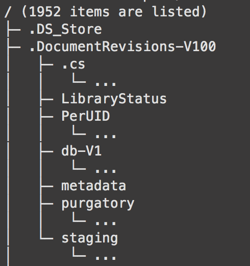

# tree-outliner
This is a simple module for printing trees (simple hash-array-combinations, defined in `index.js`) like the UNIX tool `tree` does. For enhanced visualization it uses the border characters from extended ASCII set. In the examples folder you can also find one printing filesystem structure as tree.

## Installation
```
npm i tree-outliner --save

```

## Usage
Usage is very simple. See the examples placed in `examples`.

The module exports the function `outline` and the constructor `Node`.
The latter one provides two functions:
```javascript
var Node = require("tree-outliner").Node;

var tree = new Node("root");
n.appendChild(new Node("var"));
n.appendChild("etc"); //short form, instance of Node is created implicitly
```

`outline` is then simply given the generated tree:
```javascript
...

var outline = require("tree-outliner").outline;

var stringifiedTree = outline(tree);

console.log(stringifiedTree);
```

## Example output


(The little gaps are caused by my systems font)
